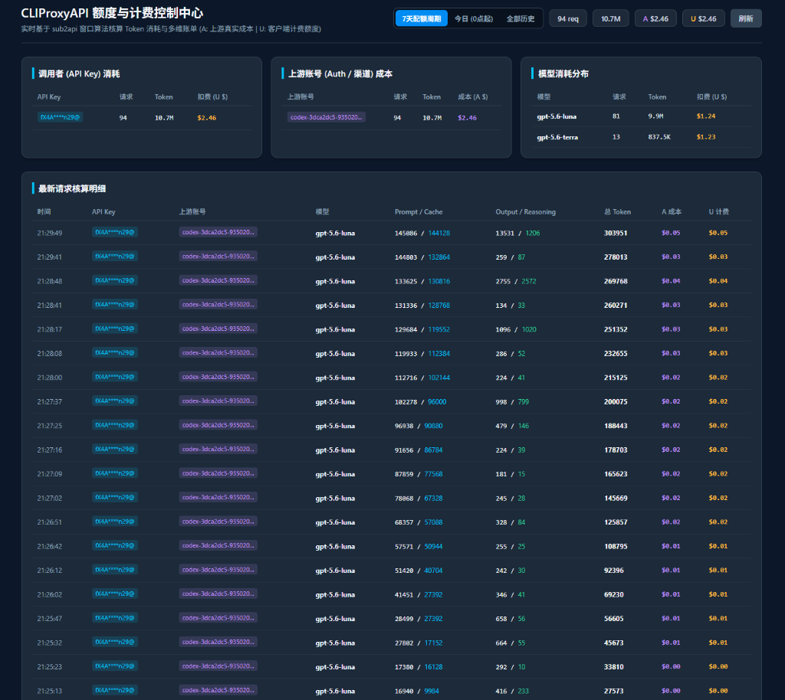
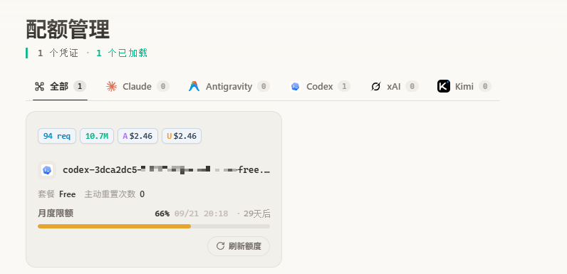

# CLIProxyAPI 额度与计费统计插件 (cpa-quota-credit)

<p align="center">
  <a href="README.md"><b>中文</b></a> | <a href="README_EN.md"><b>English</b></a>
</p>

为 **CLIProxyAPI (CPA)** 打造的高精度 Token 计量与费用核算插件。支持上游成本与下游计费分离（A $ / U $）、内置 Web 控制看板，并提供配套油猴助手在账号卡片上实时呈现用量徽章。

---

## 📸 效果展示

| 1. 独立 Web 控制看板 | 2. CPA 账号卡片徽章 (油猴助手) |
| :---: | :---: |
|  |  |

---

## ✨ 核心特性

- 🎯 **高精度计费**：覆盖 Input/Output、Reasoning 思考、Prompt Cache 缓存与长上下文阶梯计价。
- 💰 **双重账单**：上游真实成本（**A $**）与下游用户计费（**U $**）独立核算，支持自定义倍率。
- ⏳ **动态周期**：支持 **7天周期**（到期自动归零）、**今日**、**全部历史** 3 档时间窗口。
- 🛡️ **安全脱敏**：前端与流水表全链路对 API Key 自动掩码脱敏（`fX4A****n29@`）。

---

## 🚀 3 步极速使用

### 步骤 1：下载插件
在 [Releases](https://github.com/Nei-Xin/cpa-quota-credit/releases) 页面下载对应系统的压缩包（如 Linux 下载 `cpa-quota-credit-linux-amd64.tar.gz`），解压得到 `cpa-quota-credit.so` 放入 `plugins/` 目录。

### 步骤 2：添加配置
在 CLIProxyAPI 的 `config.yaml` 中添加以下配置：

```yaml
plugins:
  enabled: true
  dir: "plugins"
  configs:
    cpa-quota-credit:
      enabled: true
      priority: 10
      db_path: "./data/quota_credit.db"
```

### 步骤 3：重启 CPA 并查看
- **独立看板地址**：`http://<你的CPA地址>:<端口>/v0/resource/plugins/cpa-quota-credit/dashboard`
- **油猴助手**：[👉 点击一键直装脚本](https://raw.githubusercontent.com/Nei-Xin/cpa-quota-credit/main/cpa-quota-credit.user.js)（安装后打开 `management.html#/quota` 即可查看卡片徽章）。

---

## 🙏 致谢 (Acknowledgements)

- [CLIProxyAPI](https://github.com/router-for-me/CLIProxyAPI) - AI API 路由代理与管理网关
- [sub2api](https://github.com/Wei-Shaw/sub2api) - AI 订阅分发与计费管理系统

---

## 📄 开源许可证

本项目基于 [MIT License](LICENSE) 开源。
